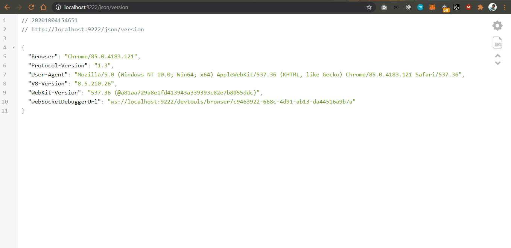

# WhatsApp Hello World!

<!-- [START badges] -->

## Primary Package used : [](https://npmjs.org/package/puppeteer)

<!-- [END badges] -->

> Idea : Third party APIs like TWILIO are good only if there is some real business and for trial purpose whatsApp service is not encouraged as the customer who receives the message should have registered for it in TWILIO already.If one wants to use just whatsApp API , he has to prove whatsApp that he owns a business.Puppeteer automates the stuff here by letting us open browser for a browser :heavy_heart_exclamation:

### Prerequisites :-

-   Get `browserWSEndpoint` of your chrome. Why do this? Because you don't want your browser to ask you scan QR to open your browser each and every time you use puppeteer. `browserWSEndpoint` is a hack to work with puppeteer in your current working chrome itself without opening a new window.
-   [Find your `browserWSEndpoint` here](https://medium.com/@jaredpotter1/connecting-puppeteer-to-existing-chrome-window-8a10828149e0).

> Note :- The selectors used for selecting classes and buttons may change in near future.

```
    "scripts": {
        "test": "echo \"Error: no test specified\" && exit 1",
        "build": "babel ./src --out-dir ./build",
        "start": "nodemon --exec babel-node index.js",
        "lint": "eslint ."
    }
```

> Contact.js

```
    const contacts = [
    { name: 'Papa', message: 'Hi! Papa' },
    { name: 'Ilu', message: 'Hi! Ilu' },
    { name: 'Shivangi', message: 'Hi! Shivangi' },
    { name: 'Family', message: 'Hi! Family' },
    { name: 'Mummy', message: 'Hi! Mummy' },
]
```

> Working demo :
> 
